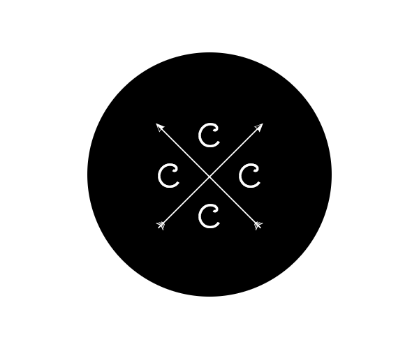

# Complex Components Consortium Cup

The `Complex Components Consortium Cup` is a competative workshop where participants compete to implement [complex components](https://github.com/complex-components/consortium#complex-components).



For more information about what a complex component is and how to implement one, check out [this readme](https://github.com/complex-components/consortium).

The `cccc` is executed with teams (or individuals) working to implement a complex component idea.
Each team get's a repo under the `Complex Components Consortium` github organization.
Progress can be measured using the [cup-dashboard](https://github.com/complex-components/cup-dashboard).
Mentors should be available during the workshop.

The following rules apply:

```
1. All components must use inline styles
2. All components must use flexbox for layout
3. All componente should support a `style` props to overwrite "look and feel"
4. Should be installable & usable via npm (commonjs)
5. Team sizes should ideally be between 1 and 3 persons
```

In addition there is a set of `secret conditions` that will give teams additional points.

A winner will be selected by mentors and prizes will be magnificent!

:medal_sports: :sparkles:

~ The Complex Components Consortium
